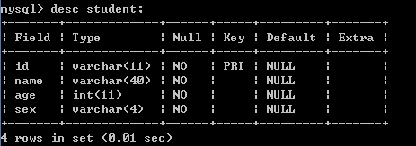
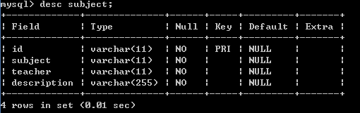
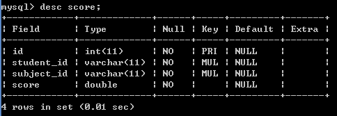
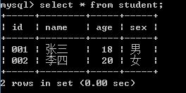
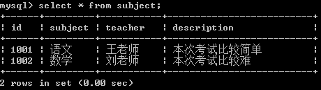
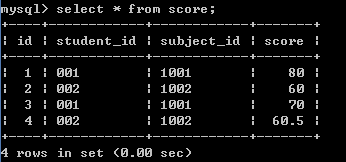

创建数据库(student_examination_sys)：

```
create database student_examination_sys;
```

student:

```
 create table if not exists student(
 id varchar(11) not null,
 name varchar(40) not null,
 age int not null,
 sex varchar(4) not null,
 primary key(id)
 );
```



subject:

```
 create table if not exists subject(
 id varchar(11) not null,
 subject varchar(11) not null,
 teacher varchar(11) not null,
 description varchar(255) not null,
 primary key(id)
 );
```



score:

```
create table if not exists score(
id int not null,
student_id varchar(11) not null,
subject_id varchar(11) not null,
score double not null,
primary key(id),
foreign key(student_id) references student(id) on delete cascade on update cascade,
foreign key(subject_id) references subject(id) on delete cascade on update cascade
);
```



student的insert：

```
 insert into student(id,name,age,sex) values ("001","张三",18,"男");
 insert into student(id,name,age,sex) values ("002","李四",20,"女");
```



subject的insert：

```
insert into subject(id,subject,teacher,description) values ("1001","语文"
,"王老师","本次考试比较简单");
insert into subject(id,subject,teacher,description) values ("1002","数学"
,"刘老师","本次考试比较难");
```



score的insert:

```
insert into score(id,student_id,subject_id,score) values (1,"001","1001",
80);
insert into score(id,student_id,subject_id,score) values (2,"002","1002",
60);
insert into score(id,student_id,subject_id,score) values (3,"001","1001",
70);
insert into score(id,student_id,subject_id,score) values (4,"002","1002",
60.5);
```



